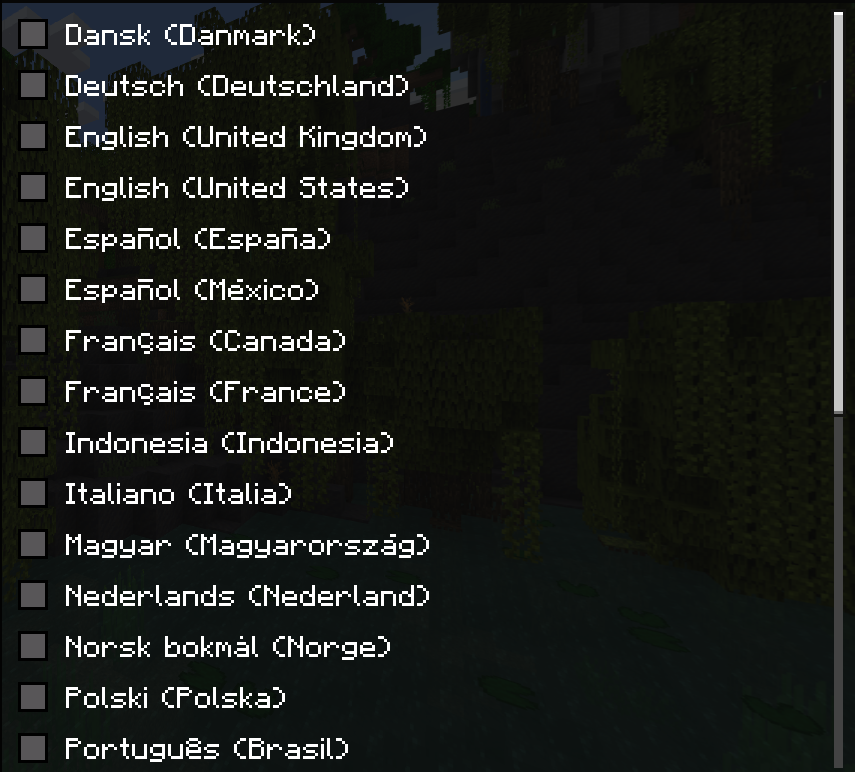
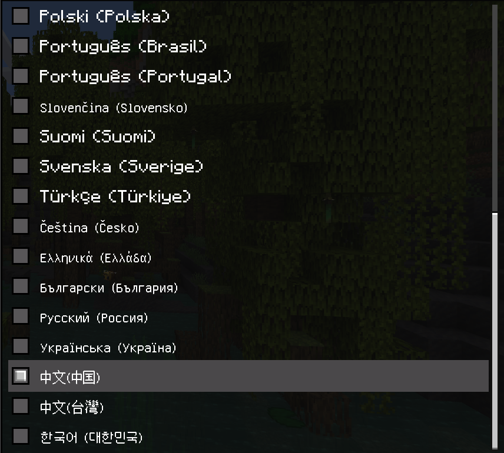

# Minecraft-Bedrock-Windows7-exe  
The English translation is from Microsoft Bing  
## 介绍 介紹 introduce
### 简体中文
由 YouTube 博主 OptiCraft 制作  
其实是教育版修改得来，也有一些魔改操作，部分地方与正常的基岩版并不相同  
下载以后直接解压压缩包，之后双击 1-Minecraft.exe 文件即可运行   
经过测试，文件存放路径中只能包含字母和数字，否则打开会报错  
### 繁體中文  
由 YouTube 博主 OptiCraft 製作  
其實是教育版修改得來，也有一些魔改操作，部分地方與正常的基岩版並不相同  
下載以後直接解壓壓縮包，之後按兩下 1-Minecraft.exe 檔即可運行   
經過測試，文檔存放路徑中只能包含字母和數字，否則打開會報錯  
### English  
Produced by YouTube blogger OptiCraft  
In fact, it is modified from the education version, and there are also some magic modification operations, and some places are different from the normal bedrock version  
After downloading, extract the compressed package directly, and then double-click the 1-Minecraft.exe file to run   
After testing, only letters and numbers can be included in the file storage path, otherwise an error will be reported when opened  
## 截图 截圖 Screenshot  
  
  
  
  
  
  
  
## 支持的语言 支援的語言 Supported languages
  
  
## 下载 下載 Download  
点击右侧的 Releases 之后展开 Assets 点击下方的 QL.zip 即可下载  
點擊右側的 Releases 之後展開 Assets 點擊下方的 QL.zip 即可下載  
Click Releases on the right and expand Assets, click QL.zip below to download  
