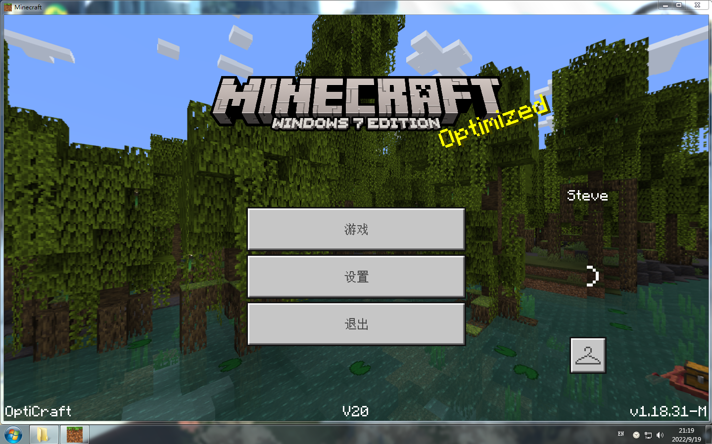
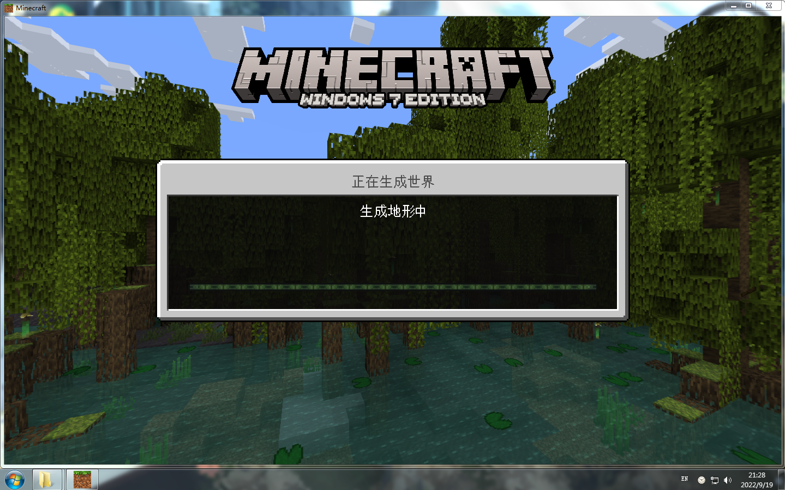

# Minecraft-Bedrock-Windows7-exe  
The English translation is from Microsoft Bing  
## 介绍 介紹 introduce
### 简体中文
由 YouTube 博主 OptiCraft 制作  
其实是教育版修改得来，也有一些魔改操作，部分地方与正常的基岩版并不相同  
下载以后直接解压压缩包，之后双击 1-Minecraft.exe 文件即可运行   
经过测试，文件存放路径中只能包含字母和数字，否则打开会报错  
### 繁體中文  
由 YouTube 博主 OptiCraft 製作  
其實是教育版修改得來，也有一些魔改操作，部分地方與正常的基岩版並不相同  
下載以後直接解壓壓縮包，之後按兩下 1-Minecraft.exe 檔即可運行   
經過測試，文檔存放路徑中只能包含字母和數字，否則打開會報錯  
### English  
Produced by YouTube blogger OptiCraft  
In fact, it is modified from the education version, and there are also some magic modification operations, and some places are different from the normal bedrock version  
After downloading, extract the compressed package directly, and then double-click the 1-Minecraft.exe file to run   
After testing, only letters and numbers can be included in the file storage path, otherwise an error will be reported when opened  
## 截图 截圖 Screenshot  
  
  
  
  
  
  
  
## 支持的语言 支援的語言 Supported languages
  
  
## 下载 下載 Download  
点击右侧的 Releases 之后展开 Assets 点击下方的 QL.zip 即可下载  
點擊右側的 Releases 之後展開 Assets 點擊下方的 QL.zip 即可下載  
Click Releases on the right and expand Assets, click QL.zip below to download  
## 帮助 幫助 help  
翻译来自微软必应  
翻譯來自微軟必應  
Translated from Microsoft Bing  
### 简体中文  
常见问题：  
- 为什么游戏在我启动时崩溃了？-  
发生这种情况是因为您没有 Windows 7 的主要更新安装并测试  
https://www.microsoft.com/es-ES/download/details.aspx?id=36805  
  
- 游戏告诉我缺少API，我该怎么办？-  
发生这种情况是因为您没有安装视觉C++。谷歌程序并安装它  
特别是2015年版本  
https://www.mediafire.com/file/2bjxzf59duumsr5/Instalador_Visual_C%252B%252B_Net_Framework_y_DirectX.zip/file  
  
- 当我打开游戏时，它告诉我“发生了错误”并且没有加载游戏我该怎么办？-  
发生这种情况是因为MceeLoginSkip（我们用来破解游戏的程序）无法正常工作  
解决方案之一是禁用防病毒软件或再次下载游戏  
  
-为什么游戏将我检测为病毒？  
因为我们需要一个名为MceeLoginSkip / 1-Minecraft的程序来破解游戏  
该程序修改了Minecraft的RAM，无需购买游戏即可破解并玩游戏  
但不幸的是，RAM 修饰符总是被检测为作弊引擎等病毒  
此外，该程序是开源的，不幸的是，他们将其从GitHub中删除了  
  
-为什么没有新版本？  
不幸的是，这个项目是基于我的世界教育版的，我们必须等待  
以发布此版本的更新。这就是原因。  
  
-------------------------------------------------------------------------------------------  
  
我用过的东西：  
MceeLoginSkip（从github中删除）  
跳过游戏登录而不抛出错误  
使用的教育版本：1.18.31（无渲染龙  
  
-------------------------------------------------------------------------------------------  
  
重新上传：  
我对你制作关于的视频没有问题  
这个我的世界我什至很感激你这样做  
但是如果你能给我留下学分，因为它需要我花很多时间来修改  
学分：  
OptiGames/OptiCraft （me） 项目的主要创建者  
KuromeSan/SilicaAndPina MCEELoginSkip 的创建者  
额外感谢：  
FrAndroid 和 Salkazapr  
帮助我解决游戏的裂缝和图标  
### 繁體中文  
常見問題：  
- 為什麼遊戲在我啟動時崩潰了？-  
發生這種情況是因為您沒有 Windows 7 的主要更新安裝並測試  
https://www.microsoft.com/es-ES/download/details.aspx?id=36805  
  
- 遊戲告訴我缺少API，我該怎麼辦？-  
發生這種情況是因為您沒有安裝視覺C++。谷歌程式並安裝它  
特別是2015年版本  
https://www.mediafire.com/file/2bjxzf59duumsr5/Instalador_Visual_C%252B%252B_Net_Framework_y_DirectX.zip/file  
  
- 當我打開遊戲時，它告訴我「發生了錯誤」並且沒有載入遊戲我該怎麼辦？-
  
發生這種情況是因為MceeLoginSkip（我們用來破解遊戲的程序）無法正常工作  
解決方案之一是禁用防病毒軟體或再次下載遊戲  
  
-為什麼遊戲將我檢測為病毒？  
  
因為我們需要一個名為MceeLoginSkip / 1-Minecraft的程式來破解遊戲  
該程式修改了Minecraft的RAM，無需購買遊戲即可破解並玩遊戲  
但不幸的是，RAM 修飾符總是被檢測為作弊引擎等病毒  
此外，該程式是開源的，不幸的是，他們將其從GitHub中刪除了  
  
-為什麼沒有新版本？  
不幸的是，這個專案是基於我的世界教育版的，我們必須等待  
以發佈此版本的更新。這就是原因。  
  
-------------------------------------------------------------------------------------------  
  
我用過的東西：  
MceeLoginSkip（從github中移除）  
跳過遊戲登錄而不拋出錯誤  
使用的教育版本：1.18.31（無渲染龍  
  
-------------------------------------------------------------------------------------------  
  
重新上傳：  
我對你製作關於的視頻沒有問題  
這個我的世界我什至很感激你這樣做  
但是如果你能給我留下學分，因為它需要我花很多時間來修改  
學分：  
OptiGames/OptiCraft （me） 專案的主要建立者  
KuromeSan/SilicaAndPina MCEELoginSkip 的建立者  
額外感謝：  
FrAndroid 和 Salkazapr  
幫助我解決遊戲的裂縫和圖示  
### English  
Frequently asked questions:  
- Why does the game crash me when I start? -  
This happens because you do not have a major update of windows 7 install it and test  
https://www.microsoft.com/es-ES/download/details.aspx?id=36805  
  
- The game tells me that an API is missing, what do I do? -  
This happens because you don't have Visual C++ installed. Google the program and install it  
Specifically the 2015 version  
https://www.mediafire.com/file/2bjxzf59duumsr5/Instalador_Visual_C%252B%252B_Net_Framework_y_DirectX.zip/file  
  
- When I open the game it tells me "An error has occurred" and does not load the game What do I do? -  
  
This happens because the MceeLoginSkip (program we used to crack the game) did not work correctly  
One of the solutions is to disable the antivirus or download the game again  
  
-Why does the game detect me as a virus?  
  
Because we need a program called MceeLoginSkip/1-Minecraft to crack the game  
This program modifies the RAM of Minecraft, to crack it and play without having to buy the game  
but unfortunately RAM modifiers are always detected as viruses like Cheat Engine  
Also this program is open source and unfortunately they removed it from GitHub   
  
-Why are there no new versions?  
Unfortunately this project is based on minecraft education edition, and we have to wait  
to release an update to this version. That's why.   
  
-------------------------------------------------------------------------------------------  
  
Things I used:  
MceeLoginSkip (removed from github)  
To skip the game login and not throw errors  
Education version used: 1.18.31 (No RenderDragon  
  
-------------------------------------------------------------------------------------------  
  
Reupload:  
I have no problem with you making a video about   
this minecraft I'm even grateful that you do it  
But if you can leave me credits since it costs me a lot to modify  
Credits:  
OptiGames/OptiCraft (me) main creator of the project  
KuromeSan/SilicaAndPina Creator of MCEELoginSkip  
Extra Thanks:  
FrAndroid and Salkazapr  
For helping me with the cracks and icons of the game  
